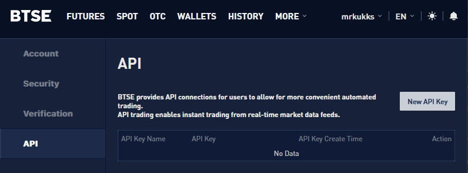
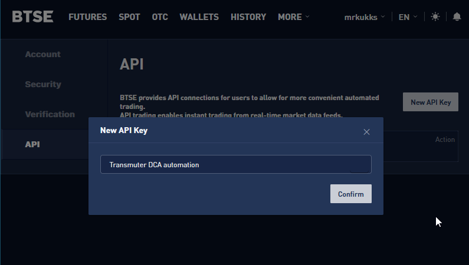
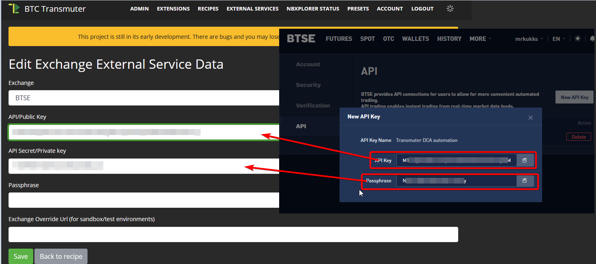
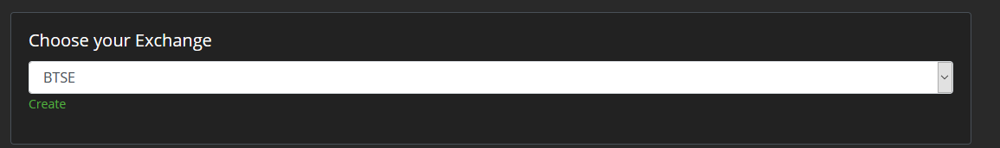

## Dollar Cost Averaging Automation

This guide shows how to setup Transmuter to automate DCA Bitcoin purchases. 

## Why use Transmuter instead of dedicated DCA services?

You get to configure everything specifically to your needs and there is no additional cost beyond the selected exchange's fees, which are usually lower than dedicated DCA providers.  

## Setup

* Create a new External Service of type "Exchange External Service"

* Configure it with the API keys from your exchange account. 

* In Transmuter, create a Preset > Dollar Cost Average.

* Select the configured exchange account

* Set how often to DCA

* Set the exchange order book and the amount to DCA with on each trade

* Create, confirm and enable the newly generated recipe!

