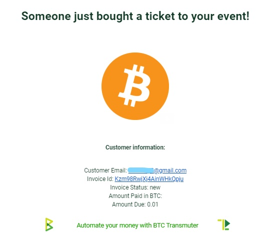

# BTCPay Email Receipts - Ticket Sale Guide

This guide shows how to setup a simple event ticket sale system, using the **BTCPay Email Receipts** preset in Transmuter.

Transmuter is currently in *alpha state*, but this preset relies mainly on sending emails, so it's fairly easy to use with your BTCPay, even if you are not a developer. What you will need in addition to Transmuter is, a BTCPayServer instance with at least one store and a few email accounts for testing your ticketing setup. This guide is using Gmail for simplicity, although other email clients can be used.

## How the Ticket Sale System Works

Create a simple BTCPay Point Of Sale App that sells tickets for a future event with limited quantity.
When someone purchases a ticket in the connected BTCPayServer POS App, send the customer an email receipt containing their QR code event ticket and send an email receipt to the event organizer, alerting of the ticket sale and the payment details.

## BTCPay POS App Setup

First create a Point of Sale App in BTCPayServer called "Ticket App" with one product (our event ticket), which has an inventory limit of quantity 30.

## Transmuter Email Receipts Setup

In our Transmuter create a Preset > BTCPay Email Receipts.

Next, connect our BTCPay as an external service to Transmuter.

Next obtain a pairing code from our BTCPay. So Transmuter can send emails when BTCPay POS invoices are paid.

Once pairing is successful shows in your BTCPay, go back to Transmuter press Save to authorize your BTCPay client connection.

Next create an email sending SMTP service.

See this [SMTP settings example](https://docs.btcpayserver.org/FAQ/FAQ-ServerSettings/#how-to-configure-smtp-settings-in-btcpay) for setup. Save after data is updated, and return to preset of Email Forwarder.

Choose the invoice status to send ticket email receipts on. During testing, use the **New** invoice status, so that payment is not required to send emails. Once everything is setup correctly and working properly, choose a status like [Paid or Confirmed](https://docs.btcpayserver.org/Invoices/).

Select send email to the address registered on the BTCPay Invoice. Be sure that the refund email setting has not been [disabled](https://docs.btcpayserver.org/FAQ/FAQ-Stores/#how-to-disable-email-on-invoices) in your BTCPay store, in order to prompt customers to provide their email before paying the invoice.

Next supply the sending email address, email subject and email body. Note the highlighted line in the picture below, it uses http://goqr.me/api to create a QR code of the invoice payment which will be used as the event ticket inside the customer's receipt email.

After saving, there will be a recipe which has been generated by the preset. In the action group, there will be one email for the customer. Next, add a second email to notify the owner of the ticket sale. This is also important in case the customer provides an incorrect email, the event organizer will still receive their payment information.

Add your second email account details, email subject and HTML email body. Note some of the purchase data you can insert into the event organizer email receipt. Press save.

Be sure to enable your recipe (checkbox).

Once the recipe is **enabled**, start creating invoices in the BTCPay POS Ticket App and see the emails sent. Providing a valid email in the POS invoice creation process will send an event ticket email receipt to the customer and a payment email to the event organizer.

When the QR code contained in the customer email is scanned (with phone camera for example), it will lead to the BTCPay invoice page to verify the ticket at your event.

Below is a basic HTML email template that the customer would receive and a basic HTML email template that the event organizer would receive, with some invoice data from the time of purchase. Feel free to improve these demo [templates](https://github.com/btcpayserver/btcTransmuter/tree/master/docs/templates).

