## BTCPay Email Receipts - Ticket Sale Guide

BtcTransmuter is a free, open-source & self-hosted tool that allows you to execute actions automatically upon specified conditions. Its primary focus is the integration of cryptocurrency services to help users manage their funds and business workflow. Purchase a web domain (example.com) and [setup your Transmuter](https://github.com/btcpayserver/btcTransmuter/blob/master/docs/index.md#how-do-i-deploy).

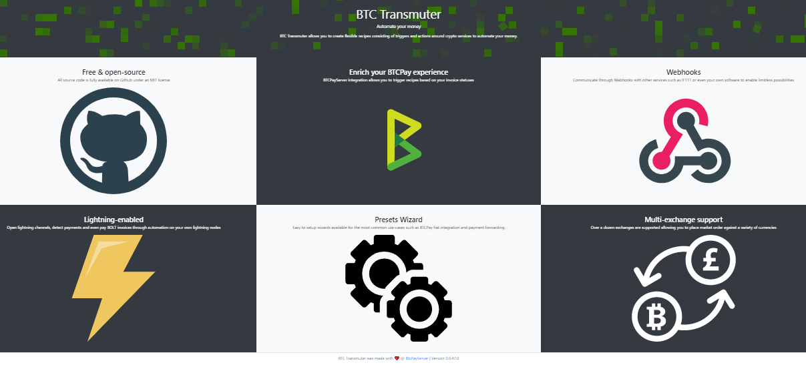

Currently there are three preset workflow operations that you can enable easily. In addition to the list below, you can create your own recipes for automating other tasks. 

1. On-chain Forwarder - Forward funds from a wallet elsewhere
2. BTCPay Email Receipts - Send an email when a BTCPay invoice gets paid
3. Fiat Conversion - Convert incoming money to fiat on an exchange by market selling when BTCPay invoice statuses change.

For this article, we will show how to setup a simple event ticket sale system, using the BTCPay Email Receipts preset in Transmuter.

Transmuter is currently in alpha state, but this preset relies mainly on sending emails, so it's fairly easy to use with your BTCPay, even if you are not a developer. What you will need in addition to Transmuter is, a BTCPayServer instance with at least one store and a few email accounts for testing your ticketing setup. We're using Gmail here for simplicity, although other email clients can be used. 

Our Ticketing System Works Like This:

We create a simple BTCPay Point Of Sale App that sells tickets for a future event with limited quantity. 
When someone purchases a ticket in our BTCPay Store, we will send them an email containing their QR code event ticket. 
We will also send ourselves an email, alerting us of the ticket sale and the payment details.

First we create a Point of Sale App in our BTCPay called "Ticket App" with one product (our event ticket), which has an inventory limit of quantity 30. (https://btcpay963570.lndyn.com/apps/PPHCjA6au1am6bEBNgfzrQy5Us2/pos)

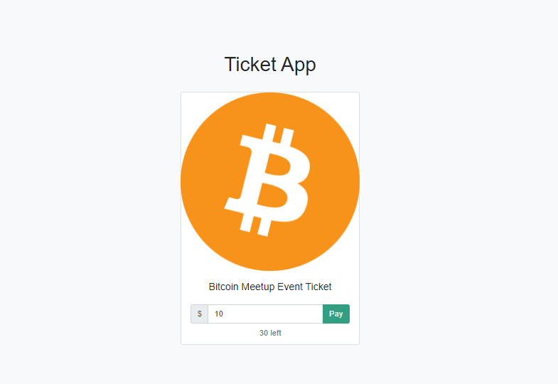

Next, in our Transmuter create a Preset > BTCPay Email Receipts. 

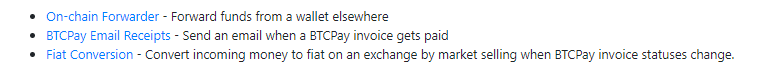

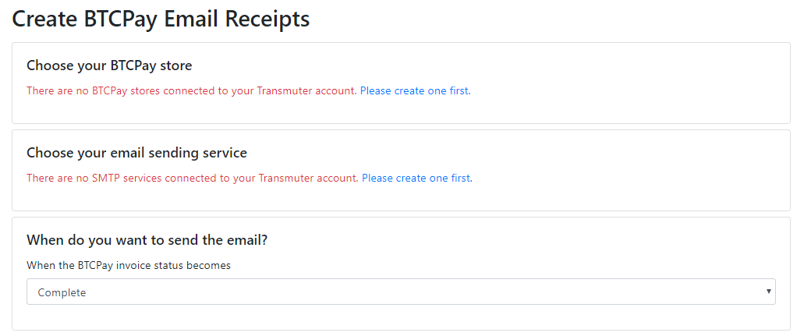

We need to connect our BTCPay as an external service to Transmuter.

Next we obtain a pairing code from our BTCPay. So we can send emails when invoices are paid. 

Once pairing is successful shows in your BTCPay, go back to Transmuter press Save to authorize your BTCPay client connection. 

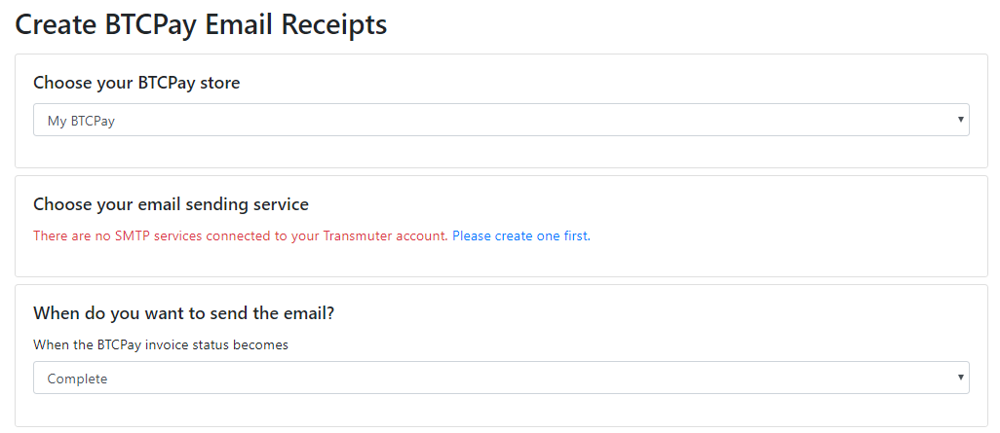

Next we choose our email sending service by creating an SMTP Service setup.

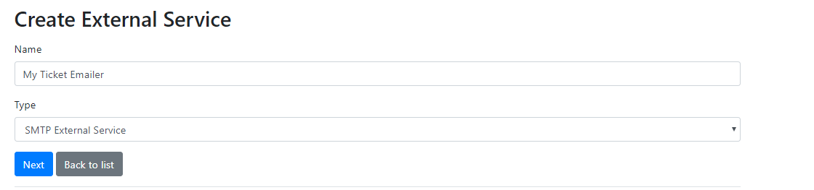

See this [SMTP settings example](https://github.com/btcpayserver/btcpayserver-doc/blob/master/FAQ/FAQ-ServerSettings.md#how-to-configure-smtp-settings-in-btcpay) for setup. Save after data is updated, and return to preset of Email Forwarder.

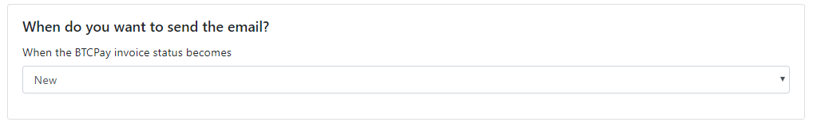

Choose the status of the invoice we want to send our tickets on. During testing we will use the New Status, so we don't need to pay the invoice to send emails. When you are ready to use your service you would want to choose a status like [Paid or Confirmed](https://github.com/btcpayserver/btcpayserver-doc/blob/master/Invoices.md). 

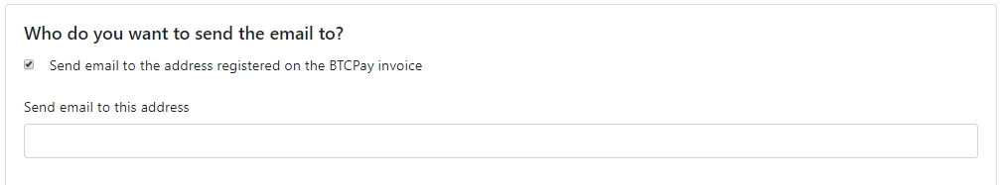

Select send email to the address registered on the BTCPay Invoice (Be sure to enable refund email in your BTCPay store to show this in your invoice page.)

Next we supply our sending email address, our email subject and email body. Note the highlighted line in the picture below, we use http://goqr.me/api to create a QR code of the invoice payment which will be used as the event ticket inside the email. (Give example html template)

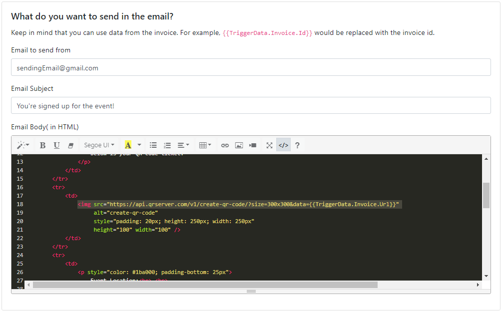

After saving, you will see a recipe has been generated for you. In our action group we have one email for the customer and now we will add a second to notify us (owner of the ticket sale).

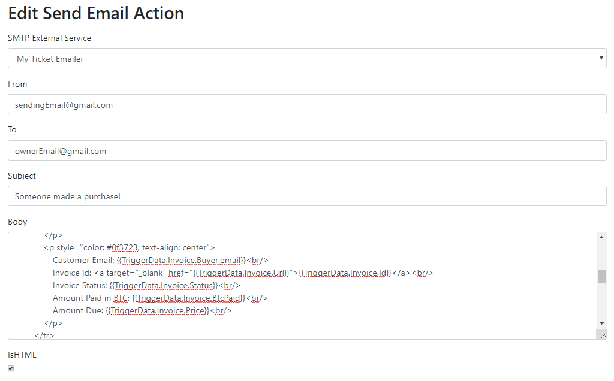

This is where you will add your second email account details, email subject and HTML email body. (Give example html template) Note some of the purchase data you can insert into our email. Press save. 

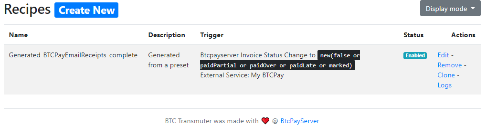

Be sure to enable your recipe (checkbox).

If your recipe is enabled you can start creating invoices in your Ticket App and see the emails sent. Use your own email in the invoice creation process and you will receive both emails. When the QR code for the ticket is scanned (with phone camera for example), it will lead to the paid BTCPay invoice page to verify the ticket at your event. 

Below is a basic HTML email template that the customer would receive and a basic HTML email template that us (the event owner) would receive, with some invoice data from the time of purchase. Feel free to improve these demo [templates]([Docs](https://github.com/britttttk/btctransmuter-vnext/blob/obsolete-meetup/docs/templates)). 

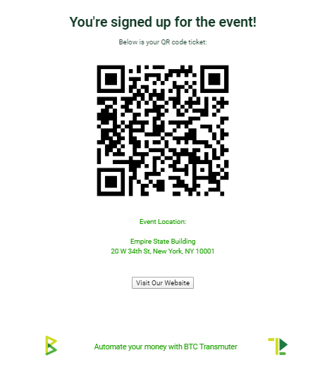

